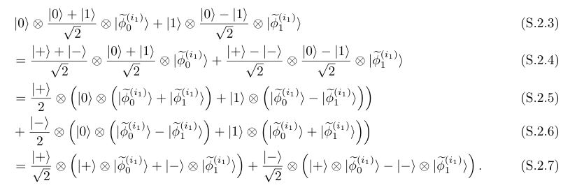

# 本周进展

在生成模型中，“从分布中抽样”通常指从一个学习到的参数化分布 $p_\theta(x)$ 中生成新样本的过程。其目标是使得生成样本的分布 $$p_\theta$$ 尽可能逼近真实数据分布 $$p_{\text{data}}$$，这通常通过最小化二者之间的统计散度（如KL散度或Wasserstein距离）来实现。

附录H.2主要就是建立了QNN完成产生随机bitstring的算法。(是sampling的过程)

（是给定参数，与bitstring x；生成一个这个条件概率下的y bitstring）

Instantaneously-deep QNNs在合适的连通结构上可以有效实现深层随机量子电路的功能（deep random quantum circuits）。

算法一：利用（many layers）deep random QNNs完成从 bitstring x到 bitstring y的概率生成

假设bitstring的大小是$n=n_1*m$, 先取前m个比特进行量子编码，按照$0\sim\ket{+},1\sim\ket{0}$,的对应方式；形成一个m比特直积态$\ket{\phi}$。

对所有的量子比特进行一层转动操作$R_z(\theta)$,参数作为转动角度出现。然后再对相邻量子比特进行CZ门以产生纠缠。

此为经过第一层之后的量子态，称为$\ket{\phi^{(1)}}$。

生成y字符串的前m个比特的方法分情况讨论：

当下一个x bitstring对应比特是0时，首先对该qbit施加一个H门，在0和1随机产生y比特；如果y比特结果为1，那么对对应位置的qbit施加Z门，改变量子态；如果结果为0，则不做操作。

当下一个x bitstring对应比特是1时，对对应的量子比特进行测量X操作，其结果为y；并且将对应量子比特替换为态$\ket{0}$.

如此操作一直进行至倒数第二个m字符串，一直给字符串y产生了$(n_1-1)*m$比特。

y的最后m给比特直接由测量倒数第二轮做完后更新后的量子态测X给出。

由此该（many layers）deep random QNNs模型完成了在特定字符串x的采样。完成了对该模型对应的conditioned  probability distribution的采样。

按照这个算法，当$x=000\cdots 0000$时，生产出来的y就是均匀分布；（运行多次）

当$x=111\cdots 1111$时，生成出来的y的分布依赖于参数$\theta$. 

算法二：利用 Shallow QNN 完成同样任务.

Shadow QNN使用n个qbits，按照一定的空间结构，拓扑结构分为$n_1$层，每层m个qbit.

大小为n的bitstriing按照统一的规则编码至n个qbits中，即$0\sim\ket{+},1\sim\ket{0}$.  每个slice上的qbits与deep QNN中每一层作用后的qbits对应。

从第一个slice的m个qbits开始，其处于的量子态也处于m比特直积态$\ket{\phi}$.

然后每个qbit进行一次转动$R_z(\theta)$，转动参数与deep QNN的第一层一样。

再进行两两间的CZ操作,得到态为$\ket{\phi^{(1)}}$，与DQNN相同。

此时可以利用已有条件概率生成bitstring y的前m的比特。与d QNN不同的是，在Shallow QNN中全部使用的量子概率，y的结果等于测量的结果。同时利用该测量结果，实现一次量子隐形teleportation，以更新第二组bit的状态。

Shadow QNN中要求在两组qbits中的对应位置的qbit进行CZ门,比如第1个qbit和第m+1个qbit.

假设选取第一层的某个比特，其与剩下m-1个qbit处于纠缠态$\ket{\phi^{(1)}}=\ket{0}\ket{\psi_0}+\ket{1}\ket{\psi
_1}$.

CZ门在对应位置比特之间建立纠缠。具体的纠缠形式与第二层对应比特是\ket{+}还是\ket{0}有关（取决于经典的x比特串）。对第一层的这个比特进行X测量，测量结果即赋予y。

当对应bit是0时，即（\ket{+}）;

一定概率y对应比特为0，其它概率为1.

读出结果之后第一层的m-1个比特和第二层的对应比特状态更新,按照

当对应bit是1时，即（\ket{0}）

这种情况下，CZ门对qbits状态不产生影响。处理与deep QNN一模一样。

对对应的量子比特进行测量X操作，其结果为y；并且将对应量子比特替换为态$\ket{0}$.(坍缩决定)

因此在测量完y的取值时，与deep QNN情形概率相同，并且第二个slice的qbits的量子态通过teleportation，和deep QNN通过第一层之后的量子态相同。

一直到最后一层：

利用归纳法证明两种算法等价：Output Distribution over y are same in deepQNN and shallowQNN.

然后我完成了这两种采样算法的编写。

粟老师给的那篇文章的标题是是生成模型中的量子优势。这些内容在生成模型的量子优势证明中的逻辑是：

H.3想要证明，经典的随机逻辑电路难采样深层量子电路产生的条件概率分布。也就是说，经典计算无法高效地完成量子电路所进行的采样任务。运用的方法是复杂性理论。假设non-uniform polynomial hierarchy does not collapse，利用反证法证明。